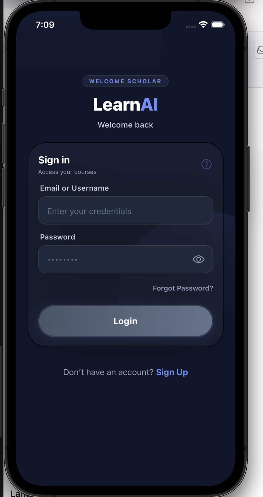
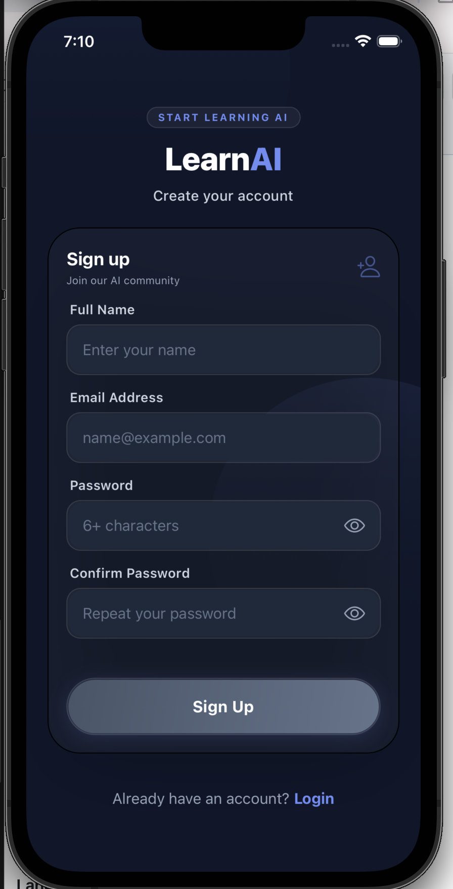

# LearnAI - Mini LMS Mobile App

LearnAI is a high-performance, premium Learning Management System (LMS) mobile application built with React Native Expo. It features a sophisticated course catalog, persistent state management, and seamless native-to-webview integration.

## 🚀 Features

- **Authentication System**: Secure login/signup using `api.freeapi.app` with token persistence via `Expo SecureStore`.
- **Course Catalog**: Dynamic course discovery using `LegendList` for high-performance list rendering and memory optimization.
- **Smart Bookmarks**: Local persistence for bookmarked courses with automatic milestone notifications.
- **Interactive WebView**: Bidirectional communication between Native and WebView for interactive learning modules.
- **Offline Resilience**: Built-in network error handling with retry mechanisms and offline status banners.
- **Native Notifications**: Local notifications for engagement milestones and return reminders.
- **Premium UI/UX**: Built with NativeWind (Tailwind CSS) and optimized for both Portrait and Landscape orientations.

## 🛠️ Technology Stack

- **Framework**: Expo SDK 54 (Latest Stable)
- **Language**: TypeScript (Strict Mode)
- **Navigation**: Expo Router (File-based routing)
- **State Management**: Zustand with Persistence
- **API Client**: Axios with Interceptors & TanStack Query (React Query)
- **Styling**: NativeWind (Tailwind CSS for React Native)
- **Optimization**: LegendList (@legendapp/list)
- **Native Modules**: Expo Notifications, Expo SecureStore, Expo Image, Expo Image Picker

## 📦 Getting Started

### Prerequisites

- Node.js (v18 or newer)
- npm or yarn
- Expo Go (for testing) or an Android/iOS Emulator

### Installation

1. Clone the repository:
   ```bash
   git clone https://github.com/Gupta4anand/LearnAi
   cd LearnAi
   ```

2. Install dependencies:
   ```bash
   npm install
   ```

3. Start the development server:
   ```bash
   npx expo start
   ```

### Running on Devices

- **Android**: Press `a` in the terminal to open in an emulator or scan the QR code with Expo Go.
- **iOS**: Press `i` to open in a simulator.

## 🏗️ Architecture Decisions

- **Folder Structure**: Organised by domains (`app`, `components`, `services`, `hooks`, `store`, `utils`) for scalability.
- **Performance**: Used `LegendList` instead of `FlatList` for smoother scrolling and lower memory footprint on large datasets.
- **Security**: Sensitive data (auth tokens) is stored exclusively in `Expo SecureStore`, while app preferences use `AsyncStorage`.
- **Error Handling**: Implemented a global interceptor pattern in Axios for token refreshing and error normalization.

## ⚠️ Known Issues / Limitations

- **Expo Go Notifications**: Full notification functionality requires a Development Build (`npx expo run:android` or `npx expo run:ios`).
- **Mock Data**: Using `freeapi.app` public endpoints which occasionally return randomized data for instructors and products.

## 📸 Screenshots




Developed as part of the React Native Expo Developer Assignment.
